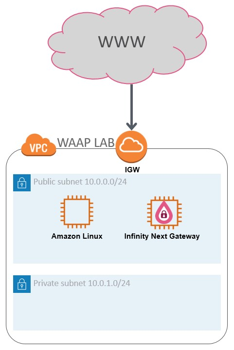

# CloudGuard-WAAP-Lab
Check Point CloudGuard WAAP (Web Application and API protection) Hands-on Lab 

This is a practical, Hands-On experience with Check Point's CloudGuard WAAP product

# Pre-requisites 
Before you begin make sure you have:
  1. an AWS account that you are able to launch network and compute resources into 
  2. Account with Check Point Infinity Portal (portal.checkpoint.com)

# Lab Topology 
Our lab environment topology is pretty straight forward, it consists of a single VPC with 2 subnets in it (private and public)
Into that VPC, we'll deploy 2 instances. First one is a vulnerable website and the second one is our WAAP gw.
Both of our deployed instances will reside on the public subnet as this will allow us to test both scenarios (with and without protection)

# Preparing your Lab environment 
Log into your AWS account (https://console.aws.amazon.com/console/home) and browse to the VPC service page  
- Use “Launch VPC Wizard” and create a “VPC with a Single Public Subnet”
  - IPv4 CIDR block - 10.0.0.0/16 
  - VPC Name “WAAP LAB” (or whatever you feel like calling it)
  - Public subnet’s IPv4 CIDR -  10.0.0.0/24
  Leave the rest with default values
- Add a private subnet
  - Name Tag – Private Subnet
  - VPC – choose “WAAP LAB” VPC we’ve just created
  - IPv4 CIDR Block - 10.0.1.0/24
  Leave the rest with default values 
- Create an EC2 key pair
  - Key pair name – WAAP LAB
  - File Format ppk
  - Tags – you can leave empty
- Launch Amazon Linux 2 AMI (HVM), SSD Volume Type
  - EC2 Size – t2.micro is sufficient
  - Network – WAAP LAB VPC
  - Subnet – Public subnet
  - Auto Assign Public IP – enable
  - Network Interfaces --> Primary IP – 10.0.0.10
  - Security Group
    * Add port 7070 from 0.0.0.0/0
  - Click “launch” to finish the setup phase and launch our instance
  Leave the rest with default values and launch the instance
- Installing Docker on our Linux EC2 server 
  -	Run “sudo yum update –y”
  - Run “sudo yum install -y docker”
  - Run “sudo service docker start”
  - Run “sudo usermod -a -G docker ec2-user”
  - Logout and log back in
- Launch our vulnerable web site 
  - Run “docker run -d -p 7070:80 raesene/bwapp”
  - Run “docker ps” and make sure our container is running 
  -	Browse to http://<instance public IP>:7070/install.php to test our installation 
    - Click on “install”
    - Login 
- Generate WAAP agent token 
  - Login to Infinity Portal (portal.checkpoint.com) 
  - Create a Localhost Asset 
    •	Go to ENVIRONMENT tab 
    •	Click on “New” to create a new asset 
    •	Choose a name for the new asset (i.e. Localhost)
    •	Under “application URL” type http://localhost and click on “+”
    •	Click the “Reverse Proxy” tab 
    •	Enter an upstream URL (i.e. http://127.0.0.1)
    •	Click “Save”
        c.	Go to “ENFORCEMENT” tab 
        d.	Under “Profiles” tab Click on “new” to create a new agent 
            •	Choose a name for the new agent (i.e. WAAPLAB)
            •	Agent type – choose “Infinity Next Gateway”
            •	Click on “Reverse Proxy” tab above 
            •	Make sure you check the previously create web asset (Localhost)
            Leave the rest with default values and click “Save”
        e.	Click on “Enforce”
        f.	Click on “Tokens” to generate a token (copy and save the token string as it will be used during gateway installation)
    8.	Install Infinity GW 
        a.	Accept “Infinity Next Gateway” Terms and conditions in the following link https://aws.amazon.com/marketplace/pp?sku=cvxnu9a4ric9yop0tp0wdistb
        b.	Launch CloudGuard Infinity Next Gateway CFT into an existing VPC (#23 on the CFT list) from the following URL                         https://supportcenter.checkpoint.com/supportcenter/portal?eventSubmit_doGoviewsolutiondetails=&solutionid=sk111013
        c.	Choose “WAAP LAB” VPC 
        d.	Choose the public and private subnets accordingly 
        e.	Choose the key pair we previously created  
        f.	Enter Password Hash (i.e. “$1$IFkdjsxm$4rreJ1DM4TFCqJ/F4I2xs/” for Cpwins1!)
        g.	Infinity Next Agent Token (paste the token generated on step 7.f. above)
        Launch the installation and wait until CloudFormation finishes 

